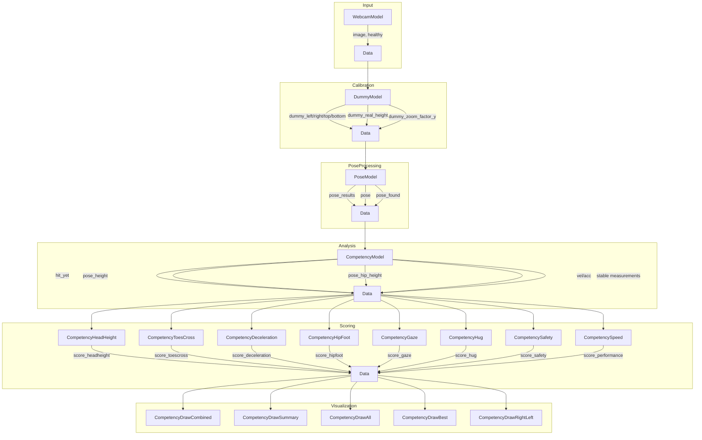

# Rugby Computer Vision Data Engineering Pipeline
This repository contains a modified version of the core data engineering components of a computer vision system that processes video data to evaluate tackling technique in rugby. The system extracts pose data from video frames, applies transformations, and calculates performance metrics in real-time.

## Pipeline Architecture
The data processing pipeline follows a modular architecture



## Key Components

### Data Extraction & Transformation
- **Pose Estimation Pipeline**: Extracts anatomical landmarks from video input using computer vision
- **Spatial Data Processing**: Converts raw coordinates into meaningful biomechanical measurements
- **Real-time Processing**: Handles streaming video data with frame-by-frame processing

### Data Processing & Analysis
- **Statistical Modeling**: Implements normal score calculations and Gaussian distributions for technique evaluation
- **Metric Calculation**: Calculates key performance indicators including head height, foot position, deceleration, etc.
- **Data Stabilization**: Applies temporal smoothing algorithms for consistent measurements

## Data Dictionary Key Fields

| Stage | Key Fields Added | Description |
|-------|-----------------|-------------|
| **Webcam** | `image` | Raw video frame |
|  | `healthy` | System integrity flag |
|  | `webcam_rect` | Display rectangle |
| **Dummy** | `dummy_left/right/top/bottom` | Tackle bag boundaries |
|  | `dummy_real_height` | Physical height for scaling |
|  | `dummy_zoom_factor_y` | Pixel-to-real-world conversion factor |
| **Pose** | `pose_results` | Raw MediaPipe detection results |
|  | `pose` | Wrapped Pose object with helper methods |
|  | `pose_found` | Boolean for successful detection |
| **Competency** | `hit_yet` | Tackle detection flag |
|  | `pose_height` | Overall height measurement |
|  | `pose_hip_height` | Hip height measurement |
|  | `vel` | Velocity measurements |
|  | `acc` | Acceleration measurements |
| **Scoring** | `score_headheight` | Head height relative to target |
|  | `score_toescross` | Foot position relative to target |
|  | `score_deceleration` | Control during approach |
|  | `score_hipfoot` | Hip-foot alignment |
|  | `score_gaze` | Head position/direction |
|  | `score_hug` | Arm wrapping technique |
|  | `score_safety` | Combined TEK score (0-100) |
|  | `score_performance` | Speed score |

## File Descriptions

- `competency.py` - Core scoring algorithms and statistical analysis components
- `pose_estimation.py` - Pose data extraction and geometric transformations
- `process_clip.py` - Main pipeline orchestration and component integration
- `models.py` - Data models and I/O operations for video processing
- `hough_test.ipynb` - Computer vision experimentation notebook for feature detection

## Processing Flow

1. The `data` dictionary is initialized in `ModelController`
2. Each model's `process()` method receives, modifies, and returns the dictionary
3. Data flows linearly through the pipeline
4. The ModelController orchestrates the sequence with:
   ```python
   def process(control, data: dict):
       for comp in control.components:
           data = comp.process(data)
       return data
   ```
5. Different visualization components use the final data state for rendering

## Installation
1. Clone the repository:
   ```bash
   git clone https://github.com/camappel/SportAnalytics-Pipeline.git
   cd SportAnalytics-Pipeline
   ```

2. Set up a virtual environment (recommended):
   ```bash
   python -m venv venv
   
   # On Windows
   venv\Scripts\activate
   
   # On macOS/Linux
   source venv/bin/activate
   ```

3. Install the required dependencies:
   ```bash
   pip install -r requirements.txt
   ```

## Running the Application
1. Download the test video ([video cut 3.mp4](https://drive.google.com/file/d/1Oh9IRFWeA_uFo74Xgbr4z2qev1hwQJ-R/view?usp=sharing)) and place in repo

1. Run the processing script:
   ```bash
   python process_clip.py
   ```
   - Process the input video with pose estimation
   - Display a visual overlay of the analysis
   - Save the processed video to `video combinedscreen 3.mp4`
   - Store pose daata data in `metrics_data.csv`